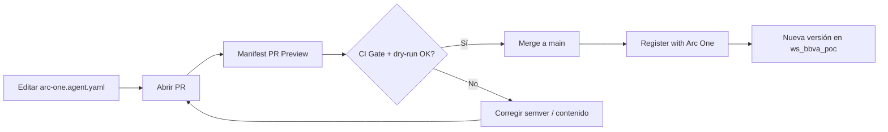

# Guía BBVA — Nova AWS + Arc One Assurance

PoC hands-on: modificar el **manifest del agente** y ver cómo Arc One registra una **nueva versión** automáticamente.

---

## Accesos

| Recurso | URL / credencial |
|---------|------------------|
| **Arc One Sandbox** | https://arc-one-sandbox.web.app |
| **Login técnico** | `tecnico@bbva.assurance.demo` / `BBVAPoC_2026` |
| **Login producto** | `producto@bbva.assurance.demo` / `BBVAPoC_2026` |
| **Workspace** | `ws_bbva_poc` (BBVA PoC) |
| **Agente** | Nova BBVA · `arc-agent-cea1bba9` |
| **Endpoint chat (AWS)** | `http://nova-bbva-aws-267727640.eu-west-1.elb.amazonaws.com/api/v1/chat` |

---

## Flujo recomendado (PR → merge → nueva versión)



### Paso 1 — Clonar y crear branch

```bash
git clone https://github.com/arc-one-assurance/arc-one-demo-nova-aws.git
cd arc-one-demo-nova-aws
git checkout -b poc/mi-cambio-manifest
```

> **Importante:** el dry-run completo contra Arc One solo corre en PRs **desde ramas del mismo repo** (colaborador). PRs desde fork reciben validación YAML básica.

### Paso 2 — Editar `arc-one.agent.yaml`

Ejemplo de cambio **material** (requiere bump de versión):

1. Subí `agent_version` (semver estricto): `1.0.0` → `1.0.1` (patch) o `1.1.0` (minor).
2. Modificá algo visible, p. ej. una línea en `system_prompt.content`:

```yaml
agent_version: "1.0.1"

system_prompt:
  content: |
    ...
    - Confirmá al usuario que no podés ejecutar operaciones antes de responder consultas sensibles.
    - (PoC) Siempre cerrá con una frase de transparencia sobre límites del asistente.
```

**No toques** `connector.endpointUrl` — CI lo resuelve con `__AWS_SERVICE_URL__`.

### Paso 3 — Abrir Pull Request

En GitHub → **Compare & pull request** hacia `main`.

El workflow **Manifest PR Preview** va a:

- Validar drift vs la versión registrada en Arc One (CI Gate)
- Verificar que subiste `agent_version` si cambió el contenido
- Ejecutar **dry-run** de registro
- Dejar un **comentario en el PR** con el JSON de preview

### Paso 4 — Merge

Tras merge a `main`, **Register with Arc One** publica la versión en `ws_bbva_poc`.

Verificá en Arc One:

1. Login como `tecnico@bbva.assurance.demo`
2. Agente **Nova BBVA** → pestaña versiones
3. Deberías ver la nueva versión (p. ej. `1.0.1`)

### Paso 5 — Assurance (opcional)

Desde Arc One, lanzá una campaña con **Pack 00** contra el conector AWS.

---

## Reglas del CI Gate

| Cambio | Qué hacer |
|--------|-----------|
| Solo typo en comentario YAML | No hace falta bump si no cambia contenido normalizado |
| Cambio en `system_prompt`, guardrails, capabilities | **Bump semver** obligatorio |
| Cambio de modelo (`agent_model`) | Bump **major** recomendado |
| Misma versión, contenido distinto | ❌ CI falla |

Sugerencia local:

```bash
python scripts/ci_manifest_gate.py arc-one.agent.yaml --suggest-bump
```

---

## Workflows GitHub Actions

| Workflow | Cuándo | Qué hace |
|----------|--------|----------|
| **CI** | Cada push/PR | typecheck, lint, test, build |
| **Manifest PR Preview** | PR que toca manifest | Gate + dry-run + comentario |
| **Register with Arc One** | Merge manifest en `main` | Publica versión en Arc One |
| **Deploy AWS** | Manual (maintainers) | Redeploy ECS Fargate |

---

## Smoke test del agente

```bash
curl -s -X POST 'http://nova-bbva-aws-267727640.eu-west-1.elb.amazonaws.com/api/v1/chat' \
  -H 'Content-Type: application/json' \
  -d '{"input":"Hola, ¿qué podés hacer?"}'
```

Respuesta esperada: JSON con campo `"output"` (texto del asistente).

---

## Soporte

- Issues en este repo para dudas de la PoC
- Arc One Assurance: equipo Arc One / maintainers del sandbox
